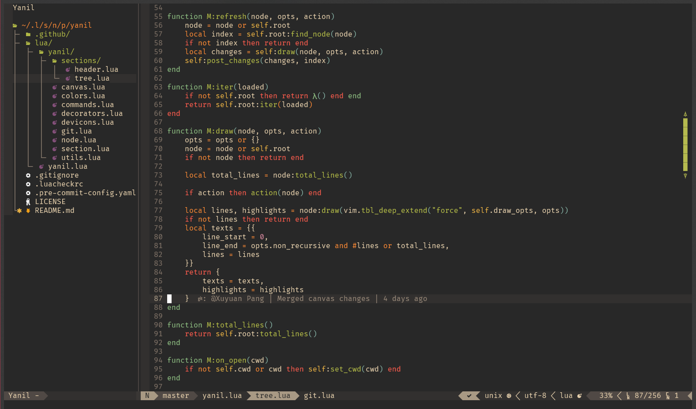

# Yanil

Yet Another Nerdtree In Lua

This not an out-of-box nerdtree alternative (and won't be), but a lib to build your own nerdtree.

## Prerequisites

- `neovim-0.11.0` or higher.

## Installation

`Plug 'Xuyuanp/yanil'`

## Setup

It's not very easy to make it work (It's just a lib).
A [sample config](https://github.com/Xuyuanp/dotfiles/blob/main/config/nvim/lua/dotvim/config/yanil.lua) can be found in my personal dotfile.

## Note

This plugin is in very early stages and has no backward compatibility guarantees.

### Known issues

- Not support for windows
- Not support for multi tabs
- ...

## Credits

- [nerdtree](https://github.com/preservim/nerdtree): It's one of the greatest vim plugin.
- [nvim-tree.lua](https://github.com/kyazdani42/nvim-tree.lua): I learned a lot from it in prototype stage.
